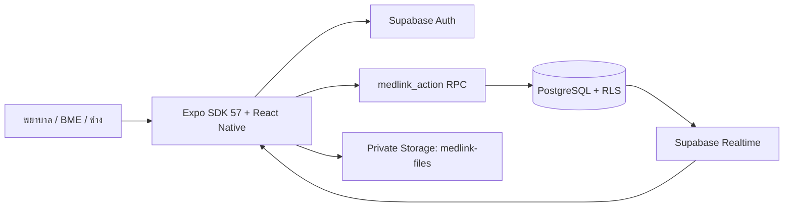

# MedLink BME — Expo Go (SDK 57)

แอป React Native สำหรับจัดการเครื่องมือแพทย์ ยืม–คืน งาน PM และแชตกับฝ่าย BME เชื่อมข้อมูลข้ามอุปกรณ์ด้วย Supabase

## ปัญหาและแรงจูงใจ

เดิมพยาบาลไม่ทราบทันทีว่าเครื่องมือแพทย์รายการใดพร้อมใช้งานเมื่อต้องการยืมจาก BME จึงต้องโทรหรือสอบถามหลายครั้ง ขณะเดียวกัน BME ต้องใช้เวลาในการตรวจสอบว่าเครื่องมือแต่ละรายการอยู่แผนกใด กำลังถูกยืม อยู่ระหว่างซ่อม หรือพร้อมใช้งานแล้ว MedLink BME จึงพัฒนาขึ้นเพื่อให้ทุกฝ่ายเห็นสถานะและตำแหน่งเครื่องมือจากข้อมูลกลางเดียวกัน ลดการสื่อสารซ้ำ และทำให้ขั้นตอนยืม–คืน–ซ่อม–PM รวดเร็วขึ้น

โฟลเดอร์ `../App` คงแอป Expo SDK 54 ไว้ ส่วนโฟลเดอร์นี้เป็นสำเนาสำหรับ SDK 57 แยก slug, URL scheme และ native bundle IDs ออกจากกัน

## เริ่มเปิดแอป

ใช้ Node.js 22 LTS ขึ้นไป และ npm (ตรวจในเครื่องนี้ด้วย Node.js 26.3.0)

```sh
cd /Users/natchapoom/Desktop/miniproject/App-sdk57
npm ci
npm start
```

สำเนานี้ใช้ Supabase URL และ publishable key จาก `.env.local` ของแอปเดิมแล้ว (`.env.local` มีเฉพาะ public client config) สแกน QR ของ Metro ด้วย Expo Go; หากย้ายเครื่องให้นำ `.env.local` มาเองหรือกำหนดค่าตาม `.env.example` แอปจะไม่สร้างข้อมูลจำลองแทนข้อมูลออนไลน์

โปรเจกต์ใช้ **Expo SDK 57 / React Native 0.86.3 / React 19.2.3** ตรวจ Expo dependencies ก่อนเปลี่ยนเวอร์ชันด้วย `npx expo install --check`.

- iPhone/iPad: ใช้ Expo Go รุ่นที่รองรับ SDK 57 จาก App Store; Expo ประกาศรองรับแล้ว
- Android: ใช้ Expo Go รุ่นล่าสุดจาก Play Store; หากยังไม่ได้รับรุ่นที่รองรับ SDK 57 ใช้ [expo.dev/go](https://expo.dev/go)
- โทรศัพท์กับคอมพิวเตอร์ต้องอยู่ Wi-Fi เดียวกัน ใช้ `npm start` ตามปกติ; `--localhost` เหมาะสำหรับ simulator เท่านั้น
- หากต้องการให้มือถือที่อยู่นอก Wi-Fi เดียวกันสแกน QR ได้ ให้ใช้ `npm run start:tunnel` หรือ `npx expo start --go --tunnel` (ต้องมีอินเทอร์เน็ตทั้งมือถือและคอมพิวเตอร์)
- Tunnel ใช้ได้ขณะที่ Metro บนคอมพิวเตอร์ยังเปิดอยู่, ช้ากว่า LAN และ URL เข้าถึงได้จากผู้ที่มีลิงก์/QR; บน iOS Expo Go กับ Expo CLI ต้องล็อกอิน Expo account เดียวกัน
- Expo Go SDK 57 กำหนดให้ sign in ด้วย Expo account ก่อนเปิดโปรเจกต์ บัญชีนี้แยกจากบัญชี MedLink
- ล้าง Metro cache หลังแก้ `.env`: `npx expo start --go --clear`
- iOS Simulator: `npm run ios`; Android Emulator: `npm run android`

## แจกแอปให้ติดตั้งบน iOS และ Android

โปรเจกต์มี EAS Build profiles ใน `eas.json` แล้ว: `preview` สร้าง APK สำหรับ Android และ build ภายในสำหรับ iOS; `production` สร้างไฟล์สำหรับส่งขึ้น App Store Connect / Google Play

ก่อน build บน EAS ให้เชื่อมโปรเจกต์กับบัญชี Expo (`npx eas-cli@latest project:init`) และเพิ่มตัวแปร `EXPO_PUBLIC_SUPABASE_URL` กับ `EXPO_PUBLIC_SUPABASE_PUBLISHABLE_KEY` ใน EAS Environment ทั้ง `preview` และ `production` โดยตั้ง visibility เป็น plaintext/sensitive ได้ เพราะทั้งสองค่าเป็น public client config ที่ฝังในแอปอยู่แล้ว ห้ามอัปโหลด `SUPABASE_SECRET_KEY` หรือ service-role key ไปเป็น `EXPO_PUBLIC_*`

```sh
npx eas-cli@latest build --platform android --profile preview
npx eas-cli@latest build --platform ios --profile preview
```

แชร์ลิงก์ build จาก Expo ให้ผู้ทดสอบ Android ติดตั้ง APK ได้โดยตรง ส่วน iOS แบบ internal ต้องมี Apple Developer Program และลงทะเบียนอุปกรณ์แต่ละเครื่องก่อน ถ้าต้องการให้เพื่อนติดตั้งง่ายผ่านลิงก์ ให้ส่ง build production ไป TestFlight; ผู้ทดสอบต้องติดตั้ง TestFlight และ build อาจต้องผ่าน Beta App Review เมื่อเชิญผู้ทดสอบภายนอก

```sh
npx eas-cli@latest build --platform all --profile production
npx eas-cli@latest submit --platform ios --latest
npx eas-cli@latest submit --platform android --latest
```

การเผยแพร่ผ่าน App Store และ Google Play ต้องมีบัญชีนักพัฒนาของแต่ละร้านและกรอกข้อมูลแอปตามข้อกำหนดของร้าน บัญชีผู้ใช้ MedLink ยังคงให้ฝ่าย BME สร้างและกำหนดสิทธิ์ ไม่เปิดสมัครสมาชิกเอง

## สร้าง Supabase project ใหม่ (ทำเฉพาะเมื่อต้องการ project แยก)

ต้องทำขั้นตอนนี้ก่อนใช้งานบัญชี ยืม–คืน และแชตจริง ไม่ต้องมี Gemini API key

1. สร้าง project ใหม่ใน [Supabase Dashboard](https://supabase.com/dashboard) และรอฐานข้อมูลพร้อมใช้งาน
2. ใน Authentication Settings ปิดการสมัครบัญชีด้วยตัวเอง (**Allow new users to sign up**) บัญชีทั้งหมดสร้างโดย BME; ตั้งความยาวรหัสผ่านขั้นต่ำ 10 ตัวอักษร
3. เชื่อม CLI และตรวจ migrations ก่อนนำขึ้น:

```sh
npx supabase login
npx supabase link --project-ref YOUR_PROJECT_REF
npx supabase db push --dry-run
npx supabase db push
npx supabase functions deploy manage-users --no-verify-jwt
```

`manage-users` ตรวจ JWT ด้วย `auth.getUser()` และตรวจบทบาท BME เองทุกคำขอ จึงไม่พึ่ง legacy gateway JWT verification ค่า URL และ server key ของ Supabase จะมีใน Edge Function environment โดยอัตโนมัติ

migrations สร้างตาราง, RLS, private Storage bucket `medlink-files`, publication สำหรับ Realtime และงานแจ้งเตือนเวลา **08:00 น. Asia/Bangkok** หาก project ปิด extension `pg_cron` ให้เปิดใน Database Extensions แล้วรัน migration ที่ค้างอีกครั้ง

สำหรับโปรเจกต์ทดสอบ/สาธิต สามารถเพิ่มเครื่องมือตัวอย่าง 10 รายการได้:

```sh
npx supabase db push --include-seed
```

Seed เพิ่มเฉพาะรหัสที่ยังไม่มี ไม่สร้างบัญชี/รหัสผ่าน ไม่ใช้ข้อมูลผู้ป่วย และเริ่มเครื่องมือในสถานะพร้อมใช้งานทั้งหมด ไม่ควร seed ลงฐานข้อมูลใช้งานจริง ดู [แนวทาง migrations](https://supabase.com/docs/guides/deployment/database-migrations)

4. คัดลอก `.env.example` เป็น `.env` และใส่ **Project URL + publishable key** จาก Project Settings / API Keys:

```env
EXPO_PUBLIC_SUPABASE_URL=https://YOUR_PROJECT.supabase.co
EXPO_PUBLIC_SUPABASE_PUBLISHABLE_KEY=YOUR_PUBLISHABLE_KEY
```

ห้ามใส่ secret/service-role key ในตัวแปร `EXPO_PUBLIC_*` เพราะค่ากลุ่มนี้ถูกรวมในแอป

## สร้างบัญชี BME แรก

คัดลอก `.env.admin.example` เป็น `.env.admin` แล้วกรอก server-side service-role key, อีเมล, รหัสผ่านอย่างน้อย 10 ตัวอักษร, ชื่อ และรหัสพนักงานของผู้ดูแล จากนั้นรัน:

```sh
npm run bootstrap:bme
```

สคริปต์ใช้ Auth Admin API และหยุดถ้ามี BME ที่ใช้งานอยู่แล้ว ไม่ส่งอีเมลและไม่พิมพ์รหัสผ่านลง log ไฟล์ `.env.admin` ถูก ignore และไม่ถูกโหลดโดย Expo เมื่อสร้างบัญชีเสร็จให้นำ secret ออกจากเครื่องที่ไม่จำเป็นต้องใช้งาน

เข้าสู่แอปด้วยอีเมล/รหัสผ่านดังกล่าว แล้วเปิด **จัดการบัญชีผู้ใช้** เพื่อสร้างพยาบาลและช่าง ตั้งรหัสผ่านใหม่ หรือระงับบัญชี บัญชีที่ระงับยังเก็บประวัติเดิมไว้ และไม่สามารถระงับ/ลดสิทธิ์ BME คนสุดท้ายได้

## ขั้นตอนใช้งาน

| บทบาท  | การใช้งาน                                                                            |
| ------ | ------------------------------------------------------------------------------------ |
| พยาบาล | ค้นหาเครื่อง ดู QR ส่งคำขอยืม ดูรายการยืม/แจ้งเตือนของตนเอง แชตและส่งรูปถึง BME      |
| BME    | เพิ่มเครื่อง อนุมัติ/ปฏิเสธคำขอ สแกนรับคืน จัดการสถานะ มอบหมาย PM จัดการบัญชี ตอบแชต |
| ช่าง   | เปิดงานที่ได้รับมอบหมาย บันทึกผล IPM แนบเอกสาร รายงานเครื่องขัดข้อง และแชตกับ BME    |

- ยืม: `ready → pending_borrow → borrowed`; BME ปฏิเสธคำขอแล้วเครื่องกลับ `ready`
- คืน: BME เลือกเครื่องที่กำลังยืม → สแกน QR จริงให้ตรงเครื่อง → ตรวจความสะอาด/อุปกรณ์/แบตเตอรี่ → ยืนยัน → `ready`
- พิมพ์รหัสเองใช้ค้นหาเท่านั้น ไม่ใช้แทนการสแกนรับคืน
- การจับคู่ QR ตรวจความตรงของรหัส ไม่ใช่หลักฐานเข้ารหัสว่าผู้ใช้ถือเครื่องอยู่จริง
- PM: ต้องไม่มีรายการยืมหรือคำขอค้างอยู่; BME มอบหมายให้ช่าง → ช่างบันทึก checklist → ผ่านทุกข้อกลับ `ready` มิฉะนั้นเป็น `repair`
- แจ้งเครื่องขัดข้องจะส่งเรื่องให้ BME โดยไม่เปลี่ยนสถานะทับรายการยืมที่ยังเปิดอยู่
- วันที่เก็บเป็น ISO date/timestamp; แสดง พ.ศ. และเวลาไทย
- แชต: พยาบาล/ช่างแต่ละคนมีห้องกับฝ่าย BME หนึ่งห้อง; BME เห็นกล่องข้อความรวม มีรูปและสถานะอ่าน
- ไฟล์แนบสูงสุด 10 MB: JPEG, PNG, WebP, PDF, DOC/DOCX ภาพและเอกสารเครื่องมือดูได้โดยบัญชีที่ใช้งานอยู่ ส่วนไฟล์แชตจำกัดเฉพาะเจ้าของห้องและ BME
- QR แชร์เป็น PNG; ประวัติ/รายการเครื่องมือส่งออก CSV ภาษาไทย; ผล IPM สร้าง PDF จากข้อมูลที่บันทึก
- รายการโปรดและการอ่านแจ้งเตือนแยกตามผู้ใช้

## ฟีเจอร์หลักและฟีเจอร์ขั้นสูง

### ฟีเจอร์หลัก

- ค้นหาเครื่องมือและกรองเฉพาะรายการที่พร้อมใช้งาน
- ส่งคำขอยืมและติดตามสถานะการอนุมัติ
- สแกน QR เพื่อยืนยันเครื่องมือก่อนรับคืน
- แสดงประวัติการยืม–คืนและสถานะเครื่องมือแบบรวมศูนย์
- รายงานเครื่องขัดข้องและแจ้งขอคืนเครื่องให้ BME

### ฟีเจอร์ขั้นสูง

- ควบคุมสิทธิ์ตามบทบาทพยาบาล, BME และช่าง
- Workflow PM/IPM พร้อม checklist แนบใบ IPM และขั้นตอนอนุมัติ
- Workflow รับเครื่องที่ถูกรายงานปัญหาและส่งต่อซ่อม
- Supabase Realtime และ polling สำรองสำหรับข้อมูลข้ามอุปกรณ์
- แชตแยกห้องระหว่างผู้ใช้งานกับ BME พร้อมรูปและสถานะอ่าน
- Private Storage, signed URL, RLS, RPC transaction และ idempotency
- ส่งออกประวัติเป็น CSV และสร้างเอกสารผล IPM เป็น PDF

## แผนภาพสถาปัตยกรรมระบบ



แอปใช้ Supabase เป็นระบบกลาง โดย Auth จัดการ session, RPC เป็นจุดเปลี่ยนข้อมูลที่ตรวจสิทธิ์, PostgreSQL/RLS จัดเก็บข้อมูลธุรกรรม และ Private Storage เก็บไฟล์ IPM กับรูปภาพ

## โครงสร้างสำหรับพัฒนาต่อ

- `app/`: Expo Router, tabs, scanner และหน้าฟอร์ม
- `src/components/`: UI React Native และตัวเลือกวันที่
- `src/state/`: session, snapshot, Realtime, โหลดใหม่เมื่อกลับเข้าแอป และ polling สำรองทุก 30 วินาทีขณะเปิดแอป
- `src/domain/`: types, วันที่ไทย, QR matching และการส่งออก
- `src/lib/`: Supabase, session ใน SecureStore แบบแบ่ง chunk, private file upload/download
- `supabase/migrations/`: SQL, สิทธิ์, transactions, idempotency, Storage, Realtime และ reminders
- `supabase/functions/manage-users/`: จัดการบัญชีจากฝั่งเซิร์ฟเวอร์
- `assets/fonts/`: Prompt Regular/SemiBold พร้อมใบอนุญาต OFL โหลดได้โดยไม่เรียก Google Fonts

การเปลี่ยนข้อมูลหลักเรียก RPC `medlink_action(p_action, p_payload, p_request_id)` ทุกครั้ง เซิร์ฟเวอร์ตรวจผู้ใช้/บทบาท/สถานะ ล็อกแถวเครื่องมือ แล้วเขียนรายการ ประวัติ และแจ้งเตือนใน transaction เดียวกัน ส่ง request ID เดิมพร้อม payload เดิมเพื่อ retry โดยไม่สร้างรายการซ้ำ

ห้ามเปิด schema `private` ใน Data API และห้ามให้ client เขียนตารางเครื่องมือ/รายการยืมโดยตรง RPC สาธารณะเป็น security invoker ส่วนฟังก์ชันทำรายการภายในกำหนด search path และตรวจสิทธิ์เอง

## ตรวจสอบโค้ด

```sh
npm run typecheck
npm test
npm run doctor
npx expo install --check
npm run build
```

`npm test` ใช้ PostgreSQL ผ่าน PGlite ในหน่วยความจำ ไม่ต้องติดตั้ง Docker และไม่แตะ Supabase จริง โดยจำลองเฉพาะ Auth/Storage platform scaffolding แล้วรัน SQL migrations ของแอปจริง ทดสอบ RLS, workflow, idempotency และวันเวลา ไม่ได้แทนการทดสอบบริการ Auth/Storage/Realtime ของ Supabase

ตรวจ Edge Function ด้วย:

```sh
npx --yes deno check supabase/functions/manage-users/index.ts
```

### ทดสอบ Supabase จริง

ใช้ project ทดสอบแยกต่างหากที่ลง migrations และ Edge Function แล้ว คัดลอก `.env.test.example` เป็น `.env.test` ใส่ keys ของ project ทดสอบ จากนั้น:

```sh
npm run test:integration
```

สคริปต์สร้างบัญชีและเครื่องมือทดสอบเฉพาะรอบนั้น ทดสอบสองคนยืมพร้อมกัน การรับคืนซ้ำ สิทธิ์ PM แชต Realtime และไฟล์ส่วนตัว แล้วลบ fixtures ของตัวเอง ไม่ reset ฐานข้อมูล หาก cleanup ไม่สำเร็จจะรายงานข้อผิดพลาด

### ทดสอบมือถือสองเครื่องก่อนส่งงาน

1. iPhone และ Android เปิดโปรเจกต์เดียวกันด้วย Expo Go SDK 57
2. ล็อกอินคนละบทบาท; พยาบาลขอยืมแล้ว BME ต้องเห็นคำขอและอนุมัติได้
3. ลองสแกนรหัสผิดเครื่องและปฏิเสธสิทธิ์กล้อง ต้องไม่รับคืนสำเร็จ; เปิดกล้องใหม่แล้วรับคืนด้วย QR ถูกเครื่อง
4. สร้างงาน PM และเข้าสู่บัญชีช่าง ทดสอบทั้งผ่านและไม่ผ่าน checklist
5. ส่งข้อความ/รูปข้ามเครื่อง ตรวจสถานะอ่าน และตรวจว่าพยาบาลอีกคนไม่เห็นห้องของคนอื่น
6. ปิดเน็ตระหว่างบันทึก ต้องแสดงข้อผิดพลาดและรักษาข้อมูลในฟอร์ม; ต่อเน็ตแล้วลองใหม่โดยประวัติไม่ซ้ำ
7. ปิด–เปิดแอป ทดสอบ session และข้อมูล, keyboard, safe area, ปุ่ม Back Android, เลือก/แชร์ไฟล์, QR และ PDF
8. ระงับบัญชีและเปลี่ยนบทบาท แล้วตรวจว่าฝั่งเซิร์ฟเวอร์ปฏิเสธสิทธิ์เดิม

## ขอบเขตและผลตรวจ

ดู `VALIDATION.md` สำหรับผลตรวจและสิ่งที่ยังต้องทดสอบบนอุปกรณ์จริง โปรเจกต์ SDK 54 อยู่ใน `../App` และใช้งานแยกได้

## เอกสารส่งงานและสมาชิกกลุ่ม

รายละเอียดเชิงเทคนิค แผนภาพสถาปัตยกรรม ขั้นตอนติดตั้ง และข้อจำกัดอยู่ที่ [`docs/TECHNICAL_IMPLEMENTATION.md`](docs/TECHNICAL_IMPLEMENTATION.md) รายงานตรวจความปลอดภัยอยู่ที่ [`docs/SECURITY-AUDIT.md`](docs/SECURITY-AUDIT.md) และผลตรวจ SDK 57 อยู่ที่ [`VALIDATION.md`](VALIDATION.md)

| สมาชิก | รหัสนักศึกษา | หน้าที่ |
|---|---:|---|
| นางสาวอรุชา สังขพันเลิศ | 6704035610014 | Front-end, UI Design, App Tester |
| นายณัชภูมิ ช่วยทอง | 6704035612173 | Back-end, UI Design, App Tester |
| นางสาวพัชราวดี พาริตา | 6704035612246 | UI Design, สไลด์, App Tester |
| นายณัฐพัชร์ โล่ห์นารายณ์ | 6704035613048 | Back-end, App Tester |

## ภาพหน้าจอและวิดีโอสาธิต

ภาพหน้าจอและวิดีโอสาธิตทั้งหมดอยู่ใน [Google Drive ของโครงการ](https://drive.google.com/drive/folders/1QUPr0yBWYZnvC2tc13nY6aewjjvXieUY) โดยจัดแยกตามบทบาทการใช้งาน:

- โฟลเดอร์ภาพหน้าจอของพยาบาล, BME และช่าง
- วิดีโอสาธิตการทำงานของแต่ละ role
- ภาพและวิดีโอสำหรับใช้ตรวจสอบ flow ในการนำเสนอ

APK สำหรับ Android (SDK 57, EAS preview, versionCode 10): [ดาวน์โหลดจาก Expo](https://expo.dev/artifacts/eas/nDucvGyLHjjldB3lpFsCPzTXYU9oeTorUWur8B_S8h8.apk)  
SHA-256: `1c8b9f0b284b009cfc95c536880df730ccb6dfbfa5d2af1bf07dc2ab21ff9635`

แอปใช้ข้อมูลของโรงพยาบาลเดียว ต้องออนไลน์เพื่อบันทึกรายการ ไม่มี offline mutation queue ไม่รวมการโทรเสียง/วิดีโอ, Face ID และ remote push ขณะปิดแอป ฟีเจอร์ที่ยังไม่รองรับไม่แสดงเป็นการทำงานจำลอง ดูข้อจำกัด [Face ID](https://docs.expo.dev/versions/v57.0.0/sdk/local-authentication/) และ [push notifications](https://docs.expo.dev/versions/v57.0.0/sdk/notifications/)

## แนวทางการพัฒนาต่อในอนาคต

- เพิ่ม offline queue และการ sync เมื่อกลับมาออนไลน์
- เพิ่ม Push Notification เมื่อมีคำขอยืม งาน PM หรือรายงานซ่อมใหม่
- เพิ่ม Face ID/ลายนิ้วมือสำหรับยืนยันตัวตนบนอุปกรณ์ที่รองรับ
- เพิ่ม dashboard วิเคราะห์อัตราการใช้งานและ downtime ของเครื่องมือ
- เพิ่มการเชื่อมต่อระบบครุภัณฑ์หรือระบบซ่อมบำรุงของโรงพยาบาล
- เพิ่ม automated end-to-end tests บนอุปกรณ์ Android และ iOS จริง

## คำชี้แจงการใช้งานอย่างรับผิดชอบ

แอปนี้เป็นระบบสาธิตและระบบจัดการสถานะเครื่องมือแพทย์ ไม่ใช่ระบบควบคุมการทำงานของเครื่องมือหรือระบบตัดสินใจทางการแพทย์ ผู้ใช้ต้องตรวจสอบเครื่องมือจริง สภาพความพร้อม และนโยบายของโรงพยาบาลก่อนนำไปใช้งาน ข้อมูลบัญชีและข้อมูลการปฏิบัติงานต้องใช้เท่าที่จำเป็น ห้ามใส่ข้อมูลผู้ป่วยหรือข้อมูลลับลงในช่องแชต/ไฟล์แนบ และต้องเก็บ service-role key ไว้ฝั่ง server เท่านั้น
