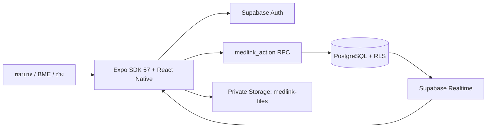

# MedLink BME — Technical Implementation

## สมาชิกและหน้าที่

| สมาชิก | รหัสนักศึกษา | หน้าที่ |
|---|---:|---|
| นางสาวอรุชา สังขพันเลิศ | 6704035610014 | Front-end, UI Design, App Tester |
| นายณัชภูมิ ช่วยทอง | 6704035612173 | Back-end, UI Design, App Tester |
| นางสาวพัชราวดี พาริตา | 6704035612246 | UI Design, สไลด์, App Tester |
| นายณัฐพัชร์ โล่ห์นารายณ์ | 6704035613048 | Back-end, App Tester |

## ภาพรวมระบบ

MedLink BME เป็นแอป React Native/Expo SDK 57 สำหรับจัดการเครื่องมือแพทย์ในโรงพยาบาล เชื่อม Supabase เป็นระบบกลาง ผู้ใช้มีสามบทบาทคือพยาบาล BME และช่าง ข้อมูลหลักอยู่ใน PostgreSQL ไฟล์อยู่ใน private Storage และการเปลี่ยนแปลงสำคัญส่งผ่าน RPC ที่ตรวจสิทธิ์ฝั่งเซิร์ฟเวอร์



## ฟีเจอร์และการทำงาน

- พยาบาลค้นหาเครื่องที่พร้อมใช้งาน ขออนุมัติยืม แจ้งขอคืน และรายงานปัญหาเครื่องที่กำลังยืม
- BME เพิ่มเครื่องมือ อนุมัติหรือปฏิเสธคำขอ สแกนรับคืน เปลี่ยนสถานะ รับเครื่องที่มีปัญหา มอบหมาย PM และจัดการบัญชี
- ช่างรับงาน PM ตรวจ checklist แนบใบ IPM ส่งให้ BME อนุมัติหรือแก้ไข และรับงานซ่อม
- QR ใช้จับคู่รหัสเครื่องก่อนรับคืนหรือรับเครื่องที่ถูกรายงาน ระบบยังตรวจสิทธิ์และสถานะในฐานข้อมูลซ้ำ
- ไฟล์ IPM และรูปภาพอยู่ใน private Storage จำกัด 10 MB และเปิดด้วย signed URL อายุ 15 นาที
- Realtime และ polling สำรองช่วยอัปเดตข้อมูลระหว่างอุปกรณ์

## การติดตั้งและรัน

```sh
cd App-sdk57
npm ci
cp .env.example .env
# ใส่ EXPO_PUBLIC_SUPABASE_URL และ EXPO_PUBLIC_SUPABASE_PUBLISHABLE_KEY
npm run typecheck
npm test
npm start
```

ใช้ `npm run start:tunnel` เมื่อต้องการเปิด Expo Go นอก Wi-Fi เดียวกัน และใช้ EAS profile `preview` สำหรับ APK:

```sh
npx eas-cli@latest build --platform android --profile preview
```

ห้ามใส่ service-role key ใน `EXPO_PUBLIC_*` และห้าม commit ไฟล์ `.env` จริง

## ข้อจำกัด

- ระบบบันทึกรายการต้องออนไลน์และยังไม่มี offline mutation queue
- Face ID/ลายนิ้วมือและ Push Notification ขณะปิดแอปยังไม่เปิดใช้งาน
- QR ยืนยันรหัสเครื่องมือ ไม่ใช่หลักฐานว่าผู้ใช้ถือเครื่องจริง
- ต้องเพิ่มลิงก์วิดีโอสาธิตภายหลัง

## หลักฐานการตรวจ

ดู `VALIDATION.md` และ `docs/SECURITY-AUDIT.md` สำหรับผลตรวจอัตโนมัติ รายการที่ต้องทดสอบบนอุปกรณ์จริง และความเสี่ยงที่ค้นพบ
